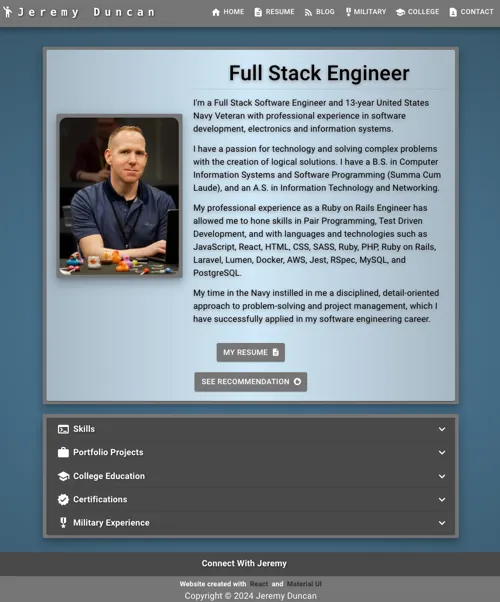
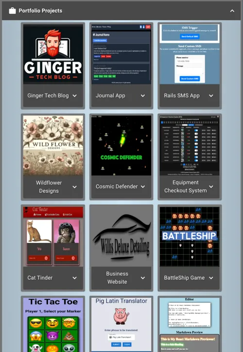
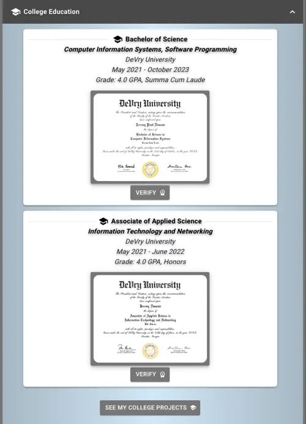
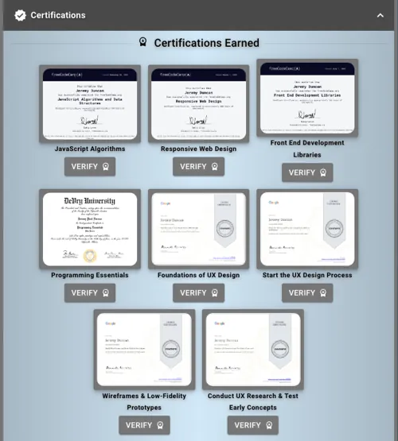
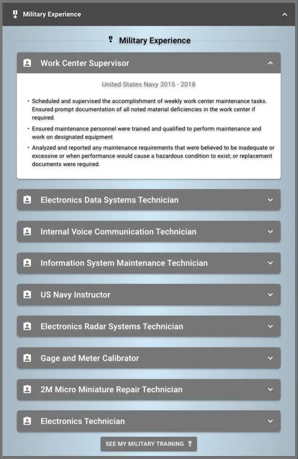

# Portfolio Site

## Overview
This React application serves as a multi-page portfolio website, leveraging React Router for navigation between different sections. The site features pages for an overview of personal projects, military training information, college projects, and contact details.

## Table of Contents
- [Features](#features)
- [Pages](#pages)
- [Setup](#setup)
- [Usage](#usage)
- [Theme](#theme)

## Features
- Multi-page navigation using React Router
- Custom Material-UI theme
- Google Analytics integration for page tracking
- Responsive design

# Pages
### Home
The homepage of the portfolio site, providing a summary of the portfolio.



### Main Page Sections
### Skills
My tech stack experience


### Portfolio Project
My relevant portfolio projects I have worked on.



### College Education
My college degrees with verified Parchment links.



### Certifications
My developer certifications.



### Military Experience
All my military experience in the US Navy.


---

### Military
Contains information on military training schools and experience.

### DeVry University Projects
Showcases various projects completed during college at DeVry University.

### Contact
Provides contact information and links to social media profiles.

## Setup
1. Clone the repository:
  ```sh
   git clone https://github.com/yourusername/portfolio-site.git
  ```
2. Navigate to the project directory:
  ```sh
  cd React-Portfolio-Site
  ```
3. Install the dependencies:
  ```sh
  yarn install
  ```
## Usage

1. Start the development server:
  ```sh
    yarn start
  ```
2. Open http://localhost:3000 to view it in your browser.

## Theme
The site uses a custom Material-UI theme defined in App.js:

  ```javascript
  const theme = createTheme({
    palette: {
      primary: {
        light: "#a4a4a4",
        main: "#757575",
        dark: "#494949",
        contrastText: "#434442",
      },
      secondary: {
        light: "#819ca9",
        main: "#d2e8f7",
        dark: "#29434e",
        contrastText: "#000000",
      },
      // Additional theme configurations
    },
  });

  ```